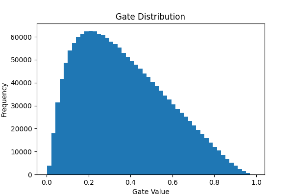
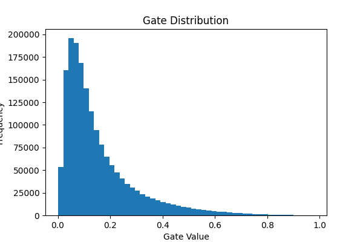
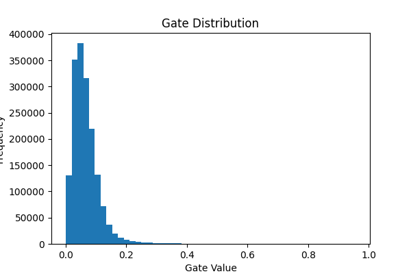

# Self-Pruning Neural Network Report

## Why L1 Penalty Encourages Sparsity

The sparsity loss is defined as the sum of all gate values:

SparsityLoss = Σ gate_i

Since gates lie between 0 and 1, minimizing this term encourages many of them to move toward zero, effectively pruning the corresponding weights.

Unlike L2 regularization, which only reduces values, L1 provides a constant gradient that pushes gate values to exactly zero. When a gate approaches zero, its corresponding weight is effectively removed, resulting in a sparse network.

---

## Results Table

| Lambda (λ) | Test Accuracy (%) | Sparsity Level (%) |
| ---------- | ----------------- | ------------------ |
| 1e-6       | 55.97%            | 0.01%              |
| 1e-5       | 55.71%            | 0.43%              |
| 1e-4       | 56.16%            | 1.45%              |

---

## Analysis of Trade-off

The parameter λ controls the balance between accuracy and sparsity.

* For small λ (1e-6), sparsity is almost zero, meaning the network behaves like a standard model.
* As λ increases, sparsity increases slightly, showing that some weights are being pruned.
* Accuracy remains nearly constant because only a small number of weights are removed.

This demonstrates that increasing λ increases pruning pressure, but in this case, the pruning effect remains limited.

---

## Gate Distribution Plot

The histogram of gate values shows how weights are distributed.

* Values close to 0 correspond to pruned weights.
* Values away from 0 correspond to active weights.

* ## Gate Distribution Plots

### λ = 1e-6

### λ = 1e-5

### λ = 1e-4

As λ increases, the distribution shows a slight shift toward zero, indicating increasing sparsity, although the effect remains limited in this setup.

In this experiment, most gate values are away from zero, indicating limited pruning.

---
